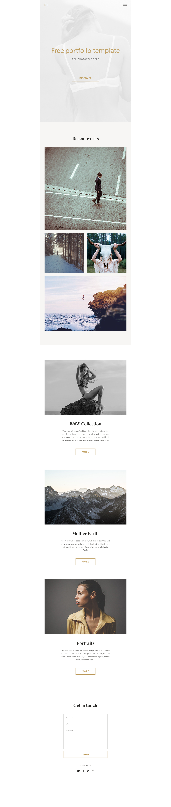

# "Photo-site"

> CSS exercise given at HEPL

* * *

**"Photo site"** is an educational project, which will be used for `HTML`/`CSS` courses.

**Note:** the school where the course is given, the [HEPL](http://www.provincedeliege.be/hauteecole) from Liège, Belgium, is a french-speaking school. From this point, the instruction will be in french. Sorry.

***
> Template from [Artø](https://www.behance.net/gallery/50668805/FREE-PORTFOLIO-TEMPLATE)
>***

## Intégration

L’intégration HTML est l'étape qui permet de transformer le fichier graphique - réalisé par le web designer - en une page web destinée à être lue sur Internet.  

Cette passerelle entre l'état statique (design) et le pseudo dynamique (maquette cliquable) est une phase obligatoire qui doit répondre à de nombreuses exigences&nbsp;: le respect du web design fourni par le designer, la conformité aux standards du web et la compatibilité avec tous les navigateurs Internet.

Pour cet exercice, votre mission est de créer un fichier `CSS` respectant rigoureusement le design du fichier Photoshop (ce fichier doit se trouver dans un dossier dédié);

**Attention, il s'agit d'un design pour tablette, pensez à bien respecter la largeur du fichier PSD**

## Police, on ne bouge plus !

Le design proposé par l'auteur requiert l'utilisation de fontes non conventionnelles.

Il existe [plusieurs techniques](https://www.alsacreations.com/astuce/lire/630-fonte-personnalisee-site-web.html) pour embarquer des fontes sur le web. Celle que nous allons utiliser pour cet exercice fait appel à un service proposé par Google&nbsp;: [Google Fonts](https://fonts.google.com).

Lorsque vous ouvrez le fichier Photoshop, vous remarquerez rapidement qu'il vous manque des fontes pour éditer le document (ce n'est pas bien grave, vous ne devez pas modifier le design). Pour récupérer ces fontes&nbsp;:

1. Rendez-vous à [cette adresse](https://fonts.google.com/);
2. Cherchez après les fontes correspondantes;
3. Ajoutez les à votre collection;
4. Dépliez le menu des collections et cliquez sur *Customize*;
5. Sélectionnez uniquement les graisses nécessaires;
6. Utilisez le @import pour embarquer les fontes dans votre fichier `CSS`;

## (Pt to) PX to EM (what?)

Pour améliorer sensiblement l'accessibilité d'un site web, il faut permettre le redimensionnement du texte, afin qu'il s'adapte aux résolutions et aux paramètres des utilisateurs. Pour cela, on utilisera [les unités relatives](https://www.alsacreations.com/article/lire/563-gerer-la-taille-du-texte-avec-les-em.html), et en particulier l'unité `em`.

Pour convertir une unité `px` en `em`, rien de plus simple. Vous prenez la base (`font-size` de l'élément) et vous divisez par la taille voulue. Exemple, je désire un `padding` de `24px` sur un élément dont le `font-size` est de `16px`.

`24px / 16px = 1.5em`

**Bon Travail&nbsp;!**